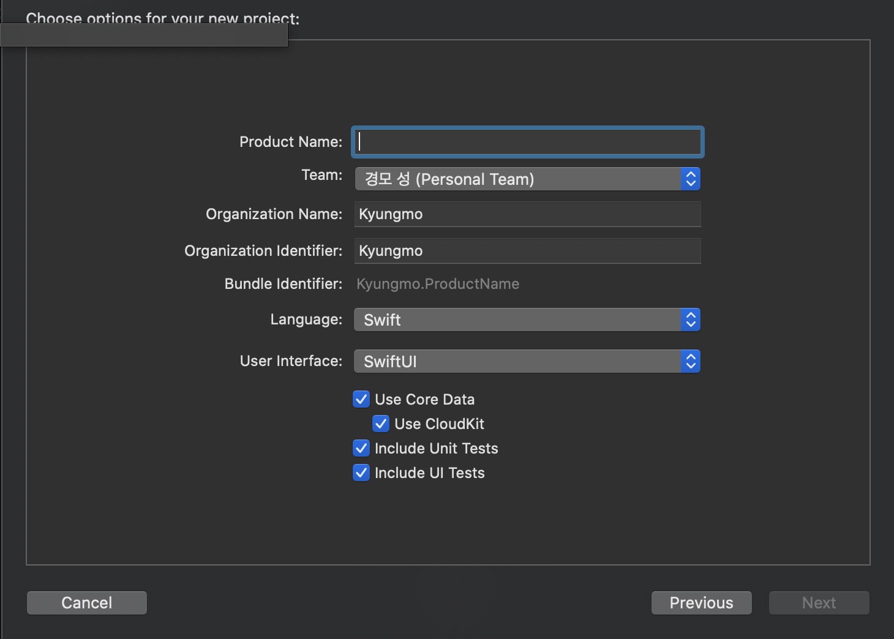
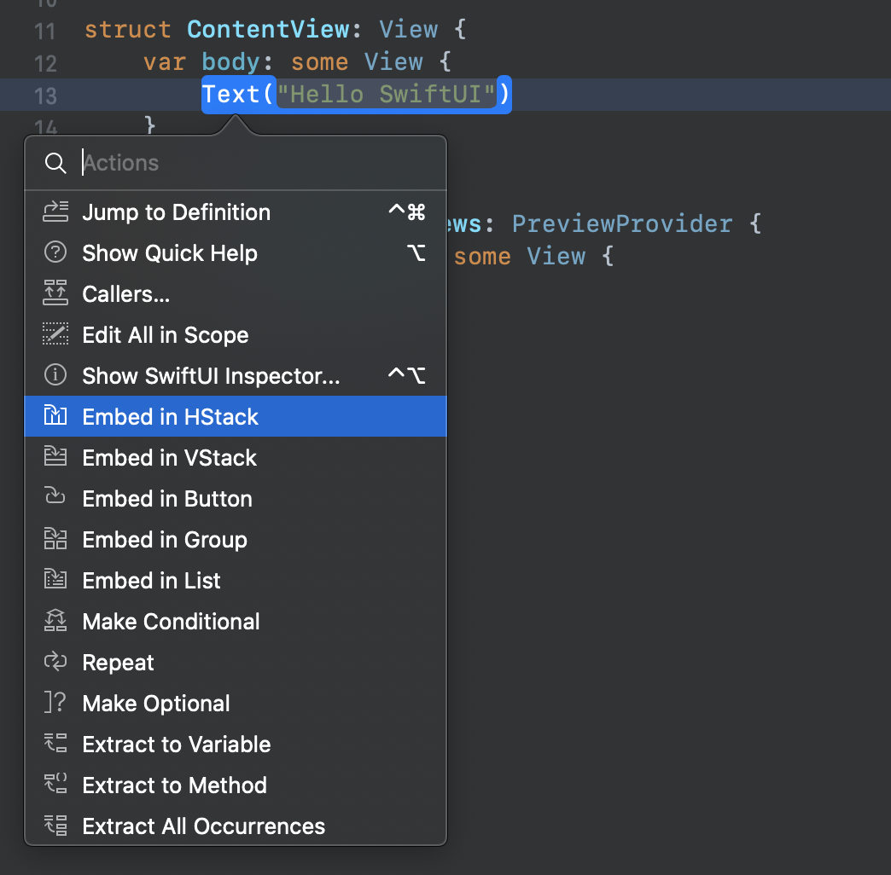
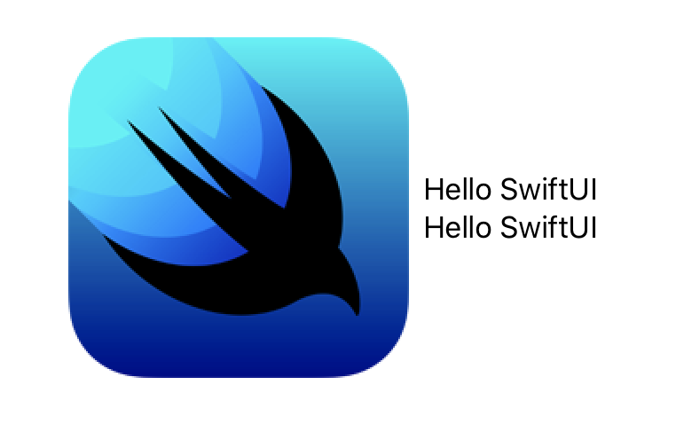
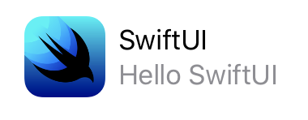
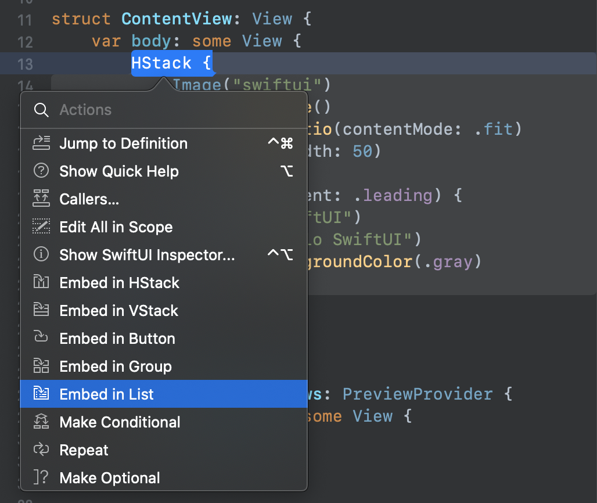
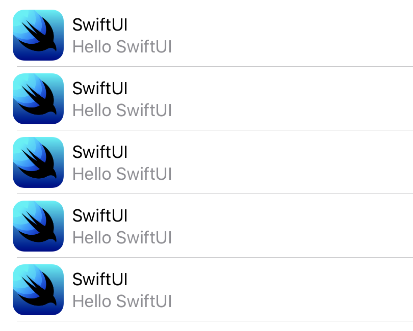
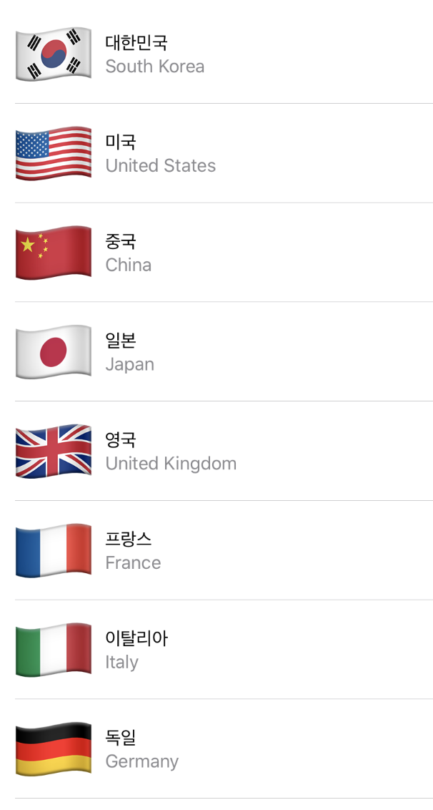
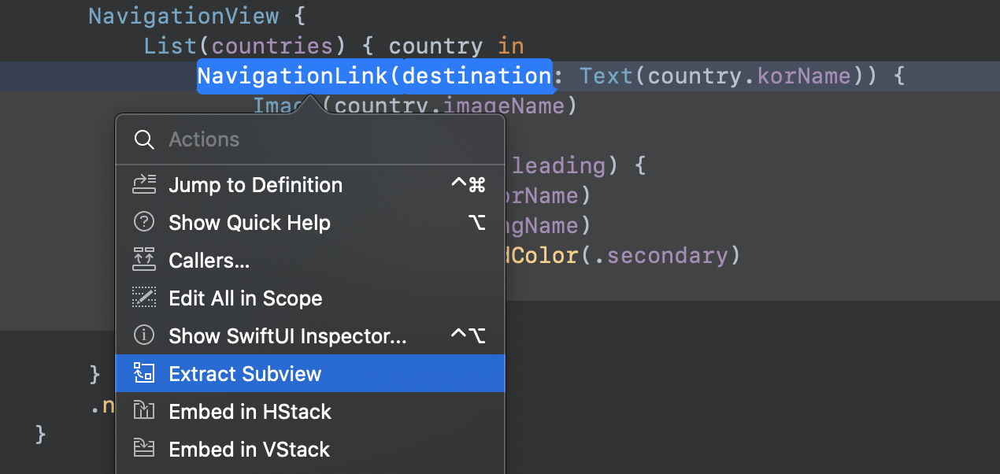
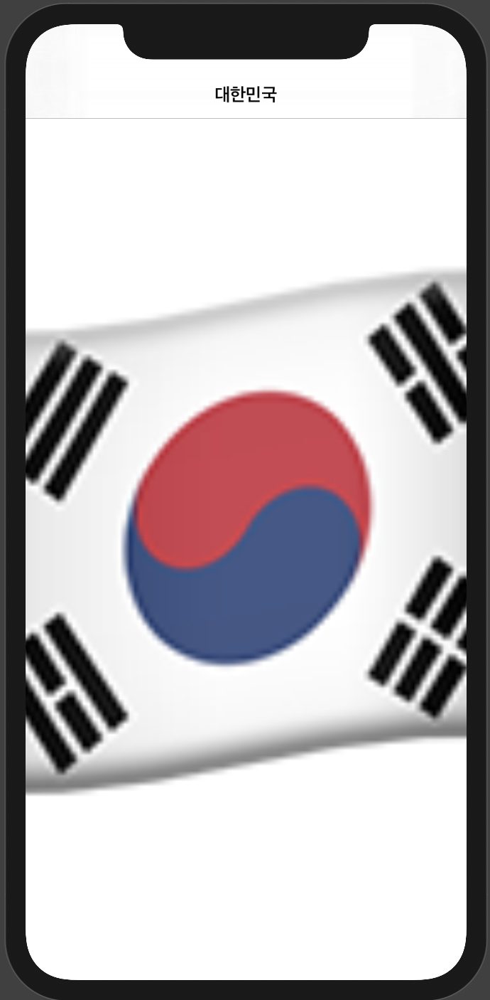

지난 WWDC 2019에서 SwiftUI가 발표되었습니다.
그동안 macOS 베타버전은 버그가 많아서 카탈리나로 업데이트를 못하고 있다가 드디어 모하비에서 카탈리나로 업데이트를 완료했습니다. 업데이트 기념으로 항상 궁금했던 SwiftUI를 사용해보고 WWDC에서 나왔던 데모 프로젝트를 같이 한번 만들어보도록 하겠습니다.
>SwiftUI는 Xcode 11 이상에서 사용 가능하며 Preview기능은 macOS Catalina 부터 사용 가능합니다.

<br>

## SwiftUI 는 무엇인가?
---
SwiftUI는 Swift의 성능을 바탕으로 모든 Apple 플랫폼에서 사용자 인터페이스를 구축할 수 있는 혁신적이고 간소화된 방법입니다. 단 하나의 도구 구성 및 API를 통해 모든 Apple 기기에서 사용할 수 있는 사용자 인터페이스를 구축합니다. 읽기 쉽고 작성하기 편한 선언적 Swift 구문을 통해 SwiftUI는 새로운 Xcode 디자인 도구와 매끄럽게 연동되면서 코드와 디자인이 완벽하게 동기화되도록 합니다. 또한 유동적 글자 크기 조절, 다크 모드, 현지화 및 손쉬운 사용을 자동 지원하므로 SwiftUI 코딩 첫 줄부터 가장 강력한 UI 코드를 작성할 수 있습니다.

<br>

## 프로젝트 생성
---
새로운 프로젝트를 만들어보겠습니다. 아래 이미지와 같이 User Interface를 보면 새롭게 추가된 SwiftUI가 보입니다. 선택하고 프로젝트 생성!
> 주의! Product Name을 SwiftUI로 만들게 되면 프로젝트명과 SwiftUI 프레임워크와 충돌이 일어나 제대로 import를 못해 에러가 일어납니다.



프로젝트를 생성하면 바로 ContentView.swift 가 열리고 오른쪽에는 정체를 알수없는 프리뷰 화면도 보입니다.   
우측 상단에 Resume버튼을 누르면 신기한 일이 일어납니다!  
빌드가 시작되고 잠시후 시뮬레이터가 엑스코드 속으로 들어온듯한 캔버스 화면이 뜹니다.  

## 프로젝트 시작
---
```swift
import SwiftUI

struct ContentView: View {
    var body: some View {
        Text("Hello World")
    }
}

struct ContentView_Previews: PreviewProvider {
    static var previews: some View {
        ContentView()
    }
}
```

`ContentView`는 말그대로 하나의 뷰를 나타내고 `ContentView_Preview`는 캔버스에 무엇을 보여줄지 설정하는 구조체 입니다. 이제 화면 중앙에 텍스트를 변경해보겠습니다.  
`Text("Hello World")`에 텍스트를 변경하면 실시간으로 캔버스에 적용됩니다.

## Stack
---
조금더 복잡한 레이아웃을 만들기 위해서 `HStack`(Horizontal), `VStack`(vertical)을 사용해 보겠습니다. (기존에 `StackView`와 같은 개념이라고 생각하시면 됩니다.)  
Cmd키를 누른상태에서 `Text()`를 선택하면 아래와 같은 메뉴들이 나타납니다.  
Embed in HStack을 선택하면 Text가 Stack안으로 들어가게 됩니다.



`HStack`안에 `Image`와 `VStack`을 넣어서  좌측에는 이미지 우측에는 2줄의 텍스트를 만들어보겠습니다.

```swift
struct ContentView: View {
    var body: some View {
        HStack {
            Image("swiftui")
            VStack {
                Text("Hello SwiftUI")
                Text("Hello SwiftUI")
            }
        }
    }
}
```

  

이미지를 넣었는데 텍스트에 비해 이미지가 너무 크네요.. 이미지 사이즈를 변경하려면 `resizable()` 옵션을 주고 `contentMode`, `frame`을 변경해주면 됩니다.

```swift
struct ContentView: View {
    var body: some View {
        HStack {
            Image("swiftui")
                .resizable()
                .aspectRatio(contentMode: .fit)
                .frame(width: 50)

            VStack(alignment: .leading) {
                Text("SwiftUI")
                Text("Hello SwiftUI")
                    .foregroundColor(.gray)
            }
        }
    }
}
```
  

이미지 사이즈를 변경하고 VStack에 alignment와 텍스트의 Color를 설정했습니다.

## List
---
이제 `TableView`처럼 리스트 형태를 만들어보겟습니다.
좀전에 만들었던 `HStack`을 Cmd클릭한후 메뉴에서 `Embed in List` 선택해주면 간단하게 리스트 형태가 만들어지게 됩니다.

```swift
struct ContentView: View {
    var body: some View {
        List(0 ..< 5) { item in
            Image("swiftui")
                .resizable()
                .aspectRatio(contentMode: .fit)
                .frame(width: 50)
            
            VStack(alignment: .leading) {
                Text("SwiftUI")
                Text("Hello SwiftUI")
                    .foregroundColor(.gray)
            }
        }
    }
}
```


## List에 데이터 적용
---
실제 데이터를 넣어보기 위해 나라 구조체를 만들고 테스트를 위한 데이터를 미리 준비합니다.
```swift
struct Country: Identifiable {
    var id = UUID()
    var korName: String
    var engName: String
    var hasVideo: Bool = false
    
    var imageName: String { return engName }
}

#if DEBUG
let testData = [
    Country(korName: "대한민국", engName: "South Korea", hasVideo: true),
    Country(korName: "미국", engName: "United States", hasVideo: true),
    Country(korName: "중국", engName: "China", hasVideo: true),
    Country(korName: "일본", engName: "Japan", hasVideo: true),
    Country(korName: "영국", engName: "United Kingdom", hasVideo: true),
    Country(korName: "프랑스", engName: "France", hasVideo: true),
    Country(korName: "이탈리아", engName: "Italy", hasVideo: true),
    Country(korName: "독일", engName: "Germany", hasVideo: true),
]
#endif
```

이제 다시 돌아와 `Country`타입 배열 `countries`을 선언하고 빈배열로 초기화 시켜줍니다. `List`에 `countries`를 넣어주고 이미지와 텍스트에 표시할 각 데이터를 연결해줍니다. 마지막으로 캔버스에서 프리뷰를 보기위해 `testData`를 넣어줍니다.
```swift
struct ContentView: View {
    var countries: [Country] = []
    var body: some View {
        List(countries) { country in
            Image(country.imageName)
            
            VStack(alignment: .leading) {
                Text(country.korName)
                Text(country.engName)
                    .foregroundColor(.secondary)
            }
        }
    }
}

struct ContentView_Previews: PreviewProvider {
    static var previews: some View {
        ContentView(countries: testData)
    }
}
```


## 네비게이션 추가
---
네이게이션을 추가하기 위해 상위에 `NavigationView`를 추가해주고 `navigationBarTitle`옵션을 추가해 타이틀을 설정해 줍니다.
```swift
struct ContentView: View {
    var countries: [Country] = []
    var body: some View {
        NavigationView {
            List(countries) { country in
                Image(country.imageName)
                
                VStack(alignment: .leading) {
                    Text(country.korName)
                    Text(country.engName)
                        .foregroundColor(.secondary)
                }
            }
            .navigationBarTitle("Country")
        }
    }
}
```
## 네비게이션 액션 및 서브뷰 추출(Extract)
---
`NavigationLink`를 추가하여 셀 이벤트를 추가합니다 `destination` 파라미터에 이동할 디테일 뷰를 설정해줄수 있습니다.  
추가로 `cmd`+클릭을 하여 복잡한 뷰를 따로 추출(Extract)하면 더 깔끔하고 재사용가능한 뷰를 만들어낼 수 있습니다. 여기서는 셀을 따로 빼내도록 하겠습니다

각 `CountryCell` 셀에 들어갈 데이터를 저장할 `country` 객체를 추가해줍니다.
```swift
struct ContentView: View {
    var countries: [Country] = []
    var body: some View {
        NavigationView {
            List(countries) { country in
                CountryCell(country: country)
            }
        }
        .navigationBarTitle("Country")
    }
}

struct ContentView_Previews: PreviewProvider {
    static var previews: some View {
        ContentView(countries: testData)
    }
}

struct CountryCell: View {
    let country: Country
    var body: some View {
        NavigationLink(destination: Text(country.korName)) {
            Image(country.imageName)
            
            VStack(alignment: .leading) {
                Text(country.korName)
                Text(country.engName)
                    .foregroundColor(.secondary)
            }
        }
    }
}
```
## 상세뷰 추가
---
이제 셀을 선택했을때 이동할 상세 뷰 `CountryDetail`를 추가해줍니다.  
`country` 객체를 추가해주고 뷰에는 각 나라의 국기 이미지를 보여지도록 해보겠습니다.
네비게이션에 `push`를 해줄것이기 때문에 상세뷰의 타이틀을 설정해줍니다. `displayMode`는 기본으로 라지타이틀이기 때문에 상세뷰에서는 `inline`옵션을 설정합니다.  
마지막으로 프리뷰에 네이게이션이 보이도록 `NavigationView`로 감싸주고 프리뷰에 보여질 임의의 테스트 데이터를 넣어줍니다.
```swift
struct CountryDetail: View {
    let country: Country
    var body: some View {
        Image(country.imageName)
            .resizable()
            .aspectRatio(contentMode: .fill)
            .navigationBarTitle(Text(country.korName), displayMode: .inline)
    }
}

struct CountryDetail_Previews: PreviewProvider {
    static var previews: some View {
        NavigationView {
          CountryDetail(country: testData[0])
        }
    }
}
```



## 탭 액션 추가
---
국기 이미지에 탭 액션을 추가해 `contentMode`가 탭을 할때마다 변하도록 해보겠습니다.  
이미지가 줌상태인지 알수있도록 `zoomed` 변수를 추가해주고 앞에 상태값임을 나타내는 `@State`어노테이션을 붙여줍니다.  
`Image`에 `onTapGesture` 옵션을 추가해 탭을 했을때 어떤 액션을 할지 넣어줍니다. 탭을 할때마다 `zoomed`을 상태를 변경해줄것이기 때문에 `zoomed.toggle()`을 사용했습니다.  
이제 `aspectRatio contentMode`에 `zoomed`의 상태에 따라 `fill`, `fit`이 바뀌도록 넣어줍니다.
```swift
struct CountryDetail: View {
    let country: Country
    @State private var zoomed = false
    
    var body: some View {
        Image(country.imageName)
            .resizable()
            .aspectRatio(contentMode: zoomed ? .fill : .fit)
            .navigationBarTitle(Text(country.korName), displayMode: .inline)
            .onTapGesture { self.zoomed.toggle() }
    }
}
```
프리뷰 화면 우측하단에 화살표(재생) 버튼을 눌러 실시간으로 어떻게 동작하는지 확인할 수 있습니다. 이미지를 클릭하면 contentMode가 바뀌면서 이미지가 확대,축소 되는것처럼 보일것입니다.
## 애니메이션
--- 
이미지가 확대, 축소될때 자연스럽게 움직이도록 애니메이션을 넣어보도록 하겠습니다.  
탭 제스쳐에 `withAnimation`을 넣어주면 확대, 축소시 간단하게 애니메이션을 추가해줄 수 있습니다.  

비디오가 있을경우 비디오 아이콘을 보여주고 확대시에 아이콘이 사라졌다가 축소하면 나타나도록 추가해보고 좌측에서 나오도록 `transition`을 적용해봅시다.
```swift
struct CountryDetail: View {
    let country: Country
    @State private var zoomed = false
    
    var body: some View {
        ZStack(alignment: .topLeading) {
            Image(country.imageName)
                .resizable()
                .aspectRatio(contentMode: zoomed ? .fill : .fit)
                .navigationBarTitle(Text(country.korName), displayMode: .inline)
                .onTapGesture {
                    withAnimation { self.zoomed.toggle() }
                }
                .frame(minWidth: 0, maxWidth: .infinity, minHeight: 0, maxHeight: .infinity)
            
            if country.hasVideo && !zoomed {
                Image(systemName: "video.fill")
                    .font(.largeTitle)
                    .padding(.all)
                    .transition(.move(edge: .leading))
            }
        }
    }
}
```
상위에 `ZStack` 추가해 비디오 이미지를 국기이미지 위에 올려놓습니다. 이미지 프레임의 max값을 `infinity`로 설정하여 비디오 이미지가 뷰의 상단에 보여지도록 수정해줍니다.  
비디오 이미지가 크게 보이도록 `largeTitle`로 설정하고 패딩을 주면 더 깔끔하게 보입니다.  
`transition`에 `move`옵션을 설정하고 왼쪽에서 나오도록 `leading`으로 설정합니다.

### 참고자료
---
>[https://developer.apple.com/kr/xcode/swiftui/](https://developer.apple.com/kr/xcode/swiftui/)
>[https://developer.apple.com/videos/play/wwdc2019/204/](https://developer.apple.com/videos/play/wwdc2019/204/)<br>
